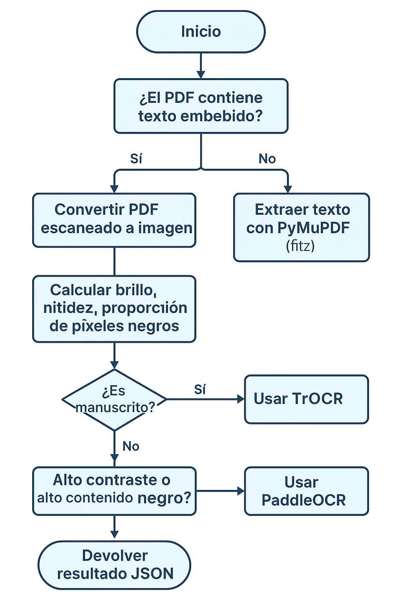

# OCR Router

Sistema modular de reconocimiento óptico de caracteres (OCR) con selección automática de motor según el tipo de documento, calidad de imagen y estilo de escritura.

---

## 🔗 Arquitectura General

- **ocr-router:** Encargado de recibir peticiones y enrutar según heurísticas.
- **ocr-api:** Provee OCR con Tesseract, TrOCR (manuscritos) y extracción de texto embebido (PDF).
- **ocr-paddle:** Motor OCR basado en PaddleOCR optimizado para texto mecano/escanéado.

Cada motor se encuentra en su contenedor independiente, comunicándose por red interna Docker (`ainetwork`).

---

## 🌐 Endpoints Disponibles

### 🔍 `/ocr-smart`
OCR inteligente con selección automática del motor o forzado por parámetro opcional.

- **Método:** `POST`
- **Contenido:** `multipart/form-data` con un archivo (`file`)
- **Parámetro opcional:** `engine=tesseract|paddle|trocr|extract` (para forzar el motor)

**Respuesta JSON esperada:**
```json
{
  "router": "tesseract",  // o "paddle", "trocr", "extract"
  "metadata": {
    "brightness": 187.34,
    "variance": 1044.56,
    "black_ratio": 0.23,
    "handwriting": false
  },
  "result": {
    "engine": "tesseract",
    "text": "Texto extraído"
  }
}
```

### 📜 `/ocr`
Extracción directa de texto embebido de archivos PDF.

- **Método:** `POST`
- **Contenido:** `multipart/form-data` con un archivo `.pdf`

**Respuesta esperada:**
```json
{
  "router": "ocr-api",
  "result": {
    "pages": [
      {"page": 1, "text": "Texto de la página 1"},
      {"page": 2, "text": "Texto de la página 2"}
    ],
    "full_text": "Texto completo concatenado"
  }
}
```

---

## 💡 Lógica de Selección Automática
El router determina el motor más adecuado según:

1. **Archivos PDF:**
   - Si tienen texto embebido, usa `/extract-pdf-text` desde `ocr-api`.
   - Si no, los convierte a imagen y trata como imagen normal.

2. **Imágenes:**
   - Cálculo de:
     - `brightness` (luminosidad)
     - `variance` (nivel de detalle/enfoque)
     - `black_ratio` (porcentaje de área negra)
     - `handwriting` (heurística booleana)

   - Selección del motor:
     - `trocr`: si se detecta manuscrito
     - `paddle`: si hay alto contraste (black_ratio > 0.25 o variance > 7000)
     - `tesseract`: caso general

---

## ✅ Ejemplos con `curl`

```bash
# OCR inteligente (detección automática)
curl -X POST http://localhost:5020/ocr-smart \
  -F "file=@factura.pdf"

# Forzar trocr (manuscritos)
curl -X POST "http://localhost:5020/ocr-smart?engine=trocr" \
  -F "file=@notas_escritas.jpg"

# Extraer texto embebido de PDF
curl -X POST http://localhost:5020/ocr \
  -F "file=@manual_digital.pdf"
```

---

## 🔄 Motores Disponibles

| Motor     | Servicio    | Tipo de contenido sugerido              |
|-----------|-------------|----------------------------------------|
| Tesseract | `ocr-api`   | Texto mecanografiado/imágenes comunes |
| TrOCR     | `ocr-api`   | Manuscritos reales                     |
| PaddleOCR | `ocr-paddle`| Documentos escaneados, facturas        |
| Extractor PDF | `ocr-api` | Archivos PDF con texto embebido     |

---

## 📊 Paginas en PDFs
La extracción de texto desde PDF (vía `extract-pdf-text`) retorna información página por página:
```json
"pages": [
  { "page": 1, "text": "Texto de la primera página" },
  { "page": 2, "text": "Texto de la segunda página" }
]
```
Esto permite procesamiento granular por página, como resumen, búsqueda o división.

---

## 🔁 Modificación y Desarrollo
Si se monta el código fuente como volumen (`/app`), cualquier cambio en `main.py` o los archivos Python se refleja automáticamente tras reiniciar el contenedor:

```bash
docker compose restart ocr-router
```

Para entornos de desarrollo, se recomienda usar `docker-compose.override.yml` para montar los volúmenes y evitar rebuilds.

---

## 🌐 Diagrama de Flujo



---

## 🔧 Estado y Salud
Todos los servicios expuestos ofrecen un endpoint `/health` para monitoreo:

```json
GET /health → { "status": "ok" }
```
